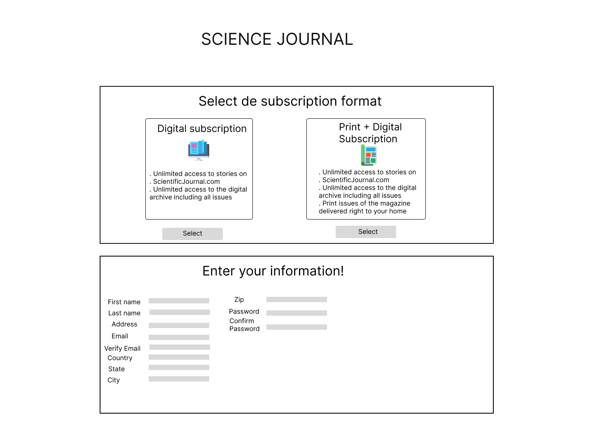

# Scientific Journal

## Resumen

En este proyecto se despliega una website que corresponde a una página de una revista científica, en ésta interfaz el usuario puede ingresar información que le permita suscribirse a la revista.

## Investigación UX

Usuarios:

Los usuarios son personas interesadas en leer articulos científicos y recibirlos en casa o por correo electronico, para ello necesitan ingresar datos personales e información de pago.

Aporte del producto:

Esta interfaz permite al usuario ingresar los datos necesarios para suscribirse a la revista.

Primer prototipo:

.png>)

Feedback:

Necesario cambiar colores, acorde a gama de colores de páginas científicas.

Prototipo final:

.png>)
.png>)
